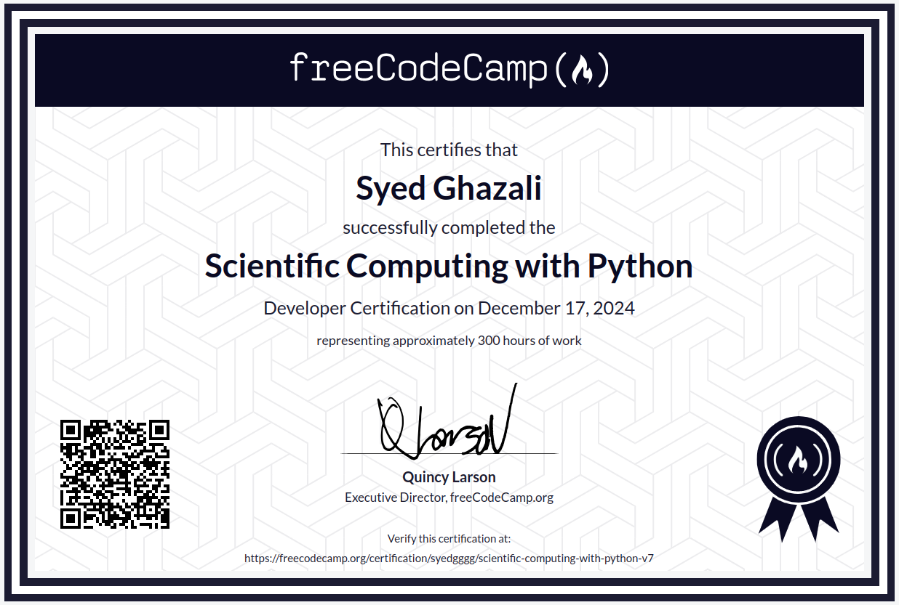
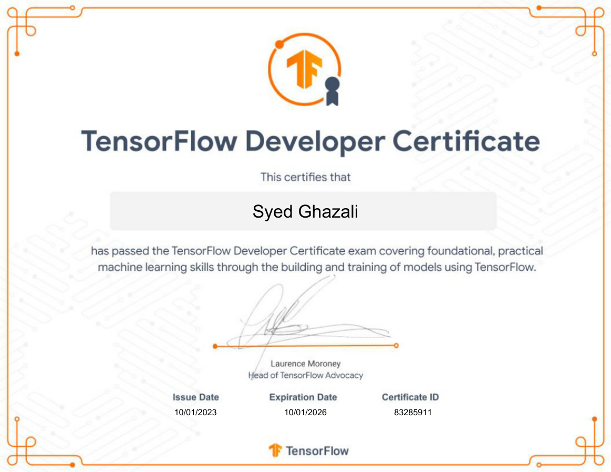
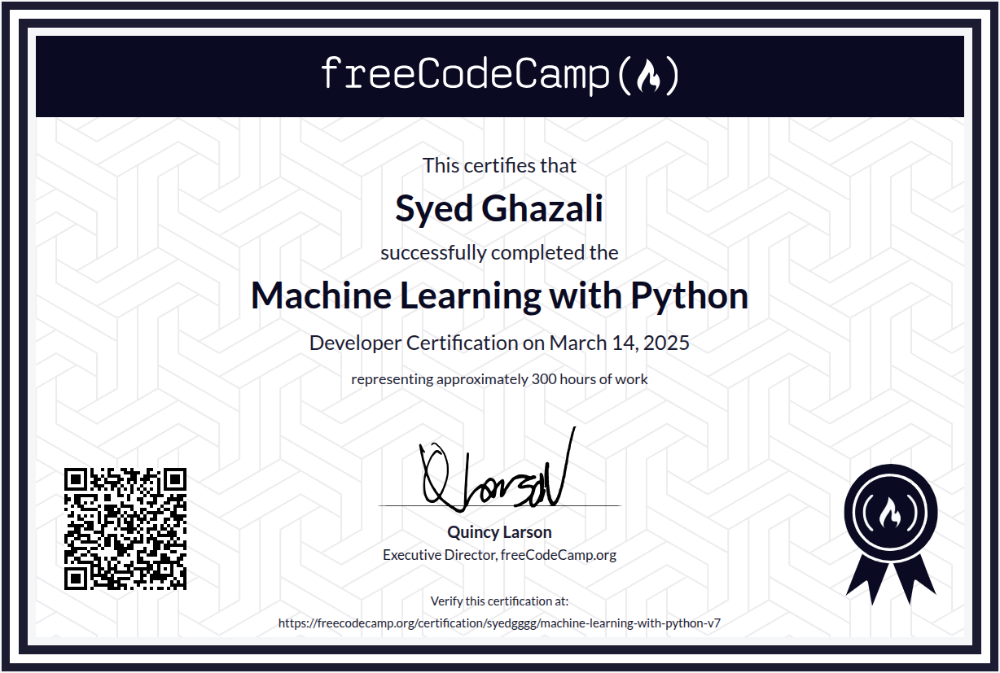
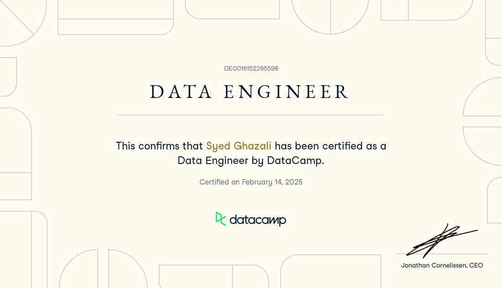
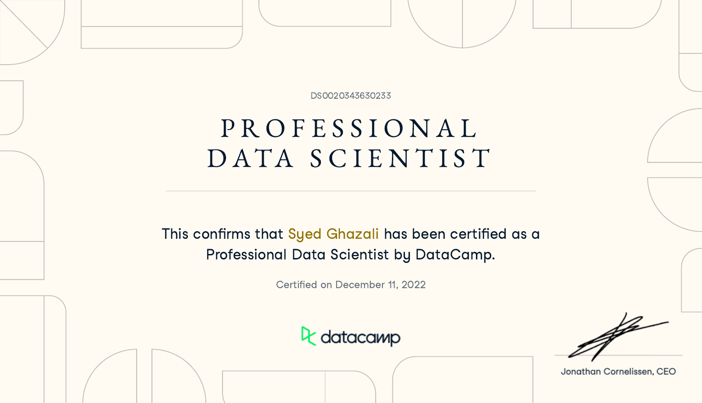
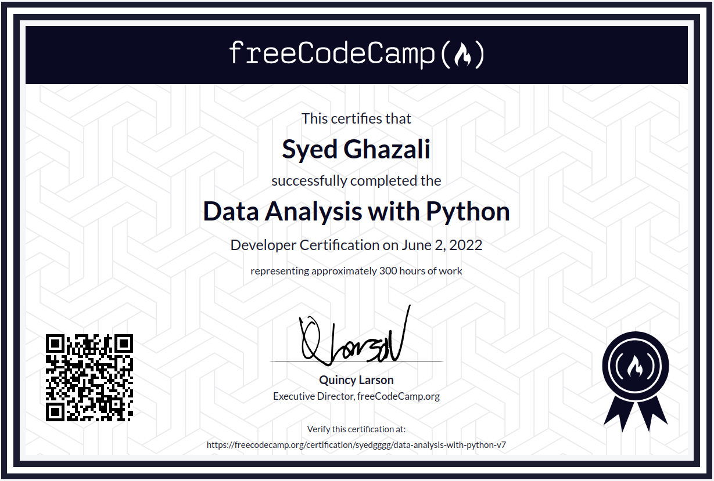

Navigate to: <a href="#technologies">Technologies</a> <b>|</b> <a href="#programming">Programming</a> <b>|</b> <a href="#machinelearningandartificialintelligence">Machine Learning & Artificial Intelligence</a> <b>|</b> <a href="#dataengineering">Data Engineering</a> <b>|</b> <a href="#datascience">Data Science</a> <b>|</b> <a href="#dataanalysis">Data Analysis</a> 

---

<h1 id='technologies'>TECHNOLOGIES</h1>
- Languages: Python, SQL, Bash, Scala, Excel
- Data Science: Pandas, NumPy, Matplotlib, scikit-learn, TensorFlow, Keras, PyTorch, NLTK, spaCy, SciPy, XGBoost
- Data Engineering: ETL, MLflow, dbt, NannyML, Spark, Kafka, Airflow, Docker, Kubernetes
- Databases: PostgreSQL, MongoDB, MySQL, Snowflake, ChromaDB
- Cloud: AWS (S3, EC2, Redshift), GCP (BigQuery), Azure
- Other: Git & GitHub, YAML, PowerPoint, LangChain, Hugging Face, GenAI

---

<h1 id='programming'>PROGRAMMING</h1>

## I. [Scientific Computing with Python](https://www.freecodecamp.org/certification/syedgggg/scientific-computing-with-python-v7)

### Projects

1. [Arithmetic Formatter](https://github.com/syedgggg/syedgggg.github.io/blob/master/assets/projects/FCCSC/1_build-an-arithmetic-formatter-project.ipynb)
   - formats arithmetic problems vertically and side-by-side from a list of strings
2. [Time Calculator](https://github.com/syedgggg/syedgggg.github.io/blob/master/assets/projects/FCCSC/2_build-a-time-calculator-project.ipynb)
   - adds duration time to start time and returns the new time with day information
3. [Budget App](https://github.com/syedgggg/syedgggg.github.io/blob/master/assets/projects/FCCSC/3_build-a-budget-app-project.ipynb)
   - tracks deposits and withdrawls with visual spending breakdown by category
4. [Polygon Area Calculator](https://github.com/syedgggg/syedgggg.github.io/blob/master/assets/projects/FCCSC/4_build-a-polygon-area-calculator-project.ipynb)
   - calculates and visually renders areas of various polygons
5. [Probability Calculator](https://github.com/syedgggg/syedgggg.github.io/blob/master/assets/projects/FCCSC/5_build-a-probability-calculator-project.ipynb)
   - simulates and calculates probabilities of drawing specific balls from a list

---

<h1 id='machinelearningandartificialintelligence'>MACHINE LEARNING & ARTIFICIAL INTELLIGENCE</h1>

## I. [TensorFlow Developer Certificate](https://www.credential.net/32336b58-f7e8-472a-8f41-6ade42699799) [[Credential Network](https://developers.google.com/certification/directory/tensorflow)]

**Computer Vision, Convolutional Neural Networks, Natural Language Processing, and real-world image data and strategies**.

---

## II. [Machine Learning with Python](https://www.freecodecamp.org/certification/syedgggg/machine-learning-with-python-v7)

### Projects

1. [Rock Paper Scissors](https://gitpod.io#snapshot/3854204e-375e-483b-9cf0-017a14c75be8)
    - markov chain-based bot winning 60%+ of games against 4 opponents (1000 matches each)
2. [Cat and Dog Image Classifier](https://github.com/syedgggg/syedgggg.github.io/blob/master/assets/projects/FCCML/2_fcc_cat_dog_updated.ipynb)
   - cnn from scratch in tensorflow achieving 74%+ (vs 63% required) on cat/dog clasification
3. [Book Recommendation Engine using KNN](https://github.com/syedgggg/syedgggg.github.io/blob/master/assets/projects/FCCML/3_fcc_book_recommendation_knn.ipynb)
   - k-nearest neighbors recommendation system suggesting 5 similar books based on a book suggestion from user
4. [Linear Regression Health Costs Calculator](https://github.com/syedgggg/syedgggg.github.io/blob/master/assets/projects/FCCML/4_fcc_predict_health_costs_with_regression.ipynb)
   - neural network predicting healthcare costs with <$3,500 mean absolute error
5. [Neural Network SMS Text Classifier](https://github.com/syedgggg/syedgggg.github.io/blob/master/assets/projects/FCCML/5_fcc_sms_text_classification_updated.ipynb)
   - spam classifier from scratch achieving 97%+ accuracy on the validation test set

---

<h1 id='dataengineering'>DATA ENGINEERING</h1>

## I. [Data Engineer Certificate](https://www.datacamp.com/certificate/DE0016152265598)

### Projects

1. [Practical Exam](https://github.com/syedgggg/syedgggg.github.io/blob/master/assets/projects/DCDE/notebook.ipynb)

---

<h1 id='datascience'>DATA SCIENCE</h1>

## I. [Data Scientist Certificate](https://www.datacamp.com/certificate/DS0020343630233)

### Projects

1. [Instructions](https://github.com/syedgggg/syedgggg.github.io/blob/master/assets/projects/DCDS/PDS-practical-exam-instructions.pdf)
2. [Technical Report](https://github.com/syedgggg/syedgggg.github.io/blob/master/assets/projects/DCDS/notebook.ipynb) 
3. [Non-Technical Presentation](https://github.com/syedgggg/syedgggg.github.io/blob/master/assets/projects/DCDS/PDS-practical-exam-non-technical-presentation.pdf)

---

<h1 id='dataanalysis'>DATA ANALYSIS</h1>

## I. [Data Analyst Certificate](https://www.datacamp.com/certificate/DA0021974290337)

### Projects

1. [Instructions](https://github.com/syedgggg/syedgggg.github.io/blob/master/assets/projects/DCDA/PDA-practical-exam-instructions.pdf)
2. [Technical Report](https://github.com/syedgggg/syedgggg.github.io/blob/master/assets/projects/DCDA/notebook.ipynb)
3. [Non-Technical Presentation](https://github.com/syedgggg/syedgggg.github.io/blob/master/assets/projects/DCDA/PDA-practical-exam-non-technical-presentation.pdf)

---

## II. [Data Analysis with Python Certification](https://www.freecodecamp.org/certification/syedgggg/data-analysis-with-python-v7)

### Projects

1. [Mean Variance Standard Deviation Calculator](https://github.com/syedgggg/syedgggg.github.io/blob/master/assets/projects/FCCDA/1-mean-variance-standard-deviation-calculator.py)
   - calculates key statistical measures (mean, variance, standard deviation, maximum, minimum, and sum) for 3x3 matrices
2. [Demographic Data Analyzer](https://github.com/syedgggg/syedgggg.github.io/blob/master/assets/projects/FCCDA/2-demographic-data-analyzer.ipynb)
   - analyzes demographic data using pandas to answer questions about income, education and work hours
3. [Medical Data Visualizer](https://github.com/syedgggg/syedgggg.github.io/blob/master/assets/projects/FCCDA/3-medical-data-visualizer.ipynb)
   - visualizes relationships between medical variables using seaborn and matplotlib
4. [Page View Time Series Visualizer](https://github.com/syedgggg/syedgggg.github.io/blob/master/assets/projects/FCCDA/4-page-view-time-series-visualizer.ipynb)
   - creates time series visualizations of page view data using pandas and matplotlib
5. [Sea Level Predictor](https://github.com/syedgggg/syedgggg.github.io/blob/master/assets/projects/FCCDA/5-sea-level-predictor.ipynb)
   - uses linear regression to predict future sea level changes based on historical data

---
